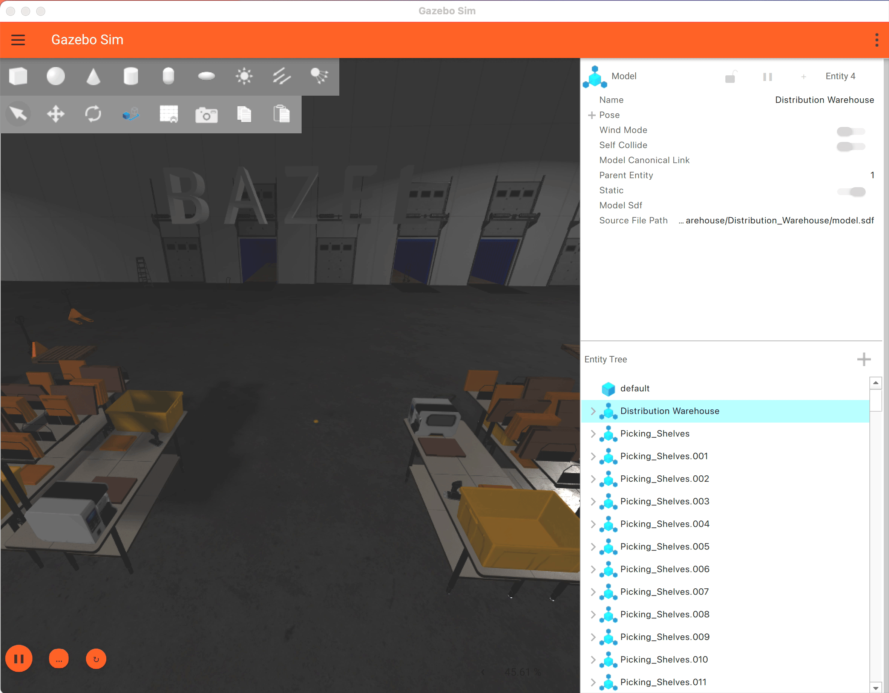

This demo program showcases use of the
[Bazel build system](https://bazel.build/) to run a client
program with the [Gazebo simulator](https://gazebosim.org/home).

Bazel build support was first available in the Jetty release and has been
backported to the Ionic release
([Gazebo releases](https://gazebosim.org/docs/latest/releases/)).
Gazebo Bazel packages are made available from the
[Bazel Central Registry](https://registry.bazel.build/modules/gz-sim), which is
the default registry used by Bazel.
Most Gazebo packages natively support both CMake and Bazel builds
(e.g.
[Gz Sim BUILD.bazel](https://github.com/gazebosim/gz-sim/blob/gz-sim10/BUILD.bazel)).
However, note that bazel build support is still work in progress. Notably, the
Gz Gui package, Gz Sim Gui client and gui plugins are not available in Bazel
build.

## Running the demo

### Install Gazebo Jetty
Follow instructions to either install Gazebo Jetty from source or from binary:
https://gazebosim.org/docs/jetty/install/

### Install Bazel
Install bazelisk, which is a version manager for bazel:
https://github.com/bazelbuild/bazelisk?tab=readme-ov-file#installation

### Clone and build the demo client program
Clone this repo and make sure it builds:
```shell
git clone https://github.com/shameekganguly/jetty_bazel_demo &&
cd jetty_bazel_demo &&
bazel build -c opt spawn_model &&
cd ..
```
Note: You may have to specify additional flags for MacOS if you run into
compilation errors, see below.

### Launch Gz Sim
Launch Gz Sim with the Jetty demo world on a new terminal:
```shell
git clone https://github.com/gazebosim/jetty_demo && \
cd jetty_demo/Jetty_Warehouse && \
GZ_SIM_RESOURCE_PATH=../../jetty_bazel_demo/resources \
GZ_IP=127.0.0.1 \
gz sim -v 4 -r jetty.sdf
```
Note that the `GZ_SIM_RESOURCE_PATH` env var is set to point to the
`jetty_bazel_demo/resources` directory so that the demo resources can be loaded
from disk in Gz Sim server.
Also note that the Gz Transport env var `GZ_IP` is set to `127.0.0.1` above as
well as in BUILD.bazel to bind to the localhost address.

Note that MacOS users will have to launch the gui client and server processes
separately, see below.

### Run the demo client
Run the demo client:
```shell
bazel run -c opt  spawn_model -- --pose 5 18 5 0 0 0
```
The spawn pose below is picked to suit the Jetty demo world. Feel free to try
out other values!

You should see the word "BAZEL" drop inside the warehouse next to the cargo bay,
then disappear and drop again repeatedly until the client program is stopped.

## On MacOS:
Due to a known bug, the demo can only be run with Gazebo Ionic on MacOS:
https://gazebosim.org/docs/ionic/install_osx/

Also note that running Gz Sim on MacOS requires the server and gui client
processes to be run on separate terminals.

```shell
# On terminal 1
GZ_IP=127.0.0.1 gz sim -v 4 -g

# On terminal 2
GZ_SIM_RESOURCE_PATH=../../jetty_bazel_demo/resources \
GZ_IP=127.0.0.1 \
gz sim -v 4 -r -s jetty.sdf

# On terminal 3
bazel run --macos_minimum_os=15.5 --features=-layering_check -c opt \
spawn_model -- --pose 5 18 5 0 0 0
```
